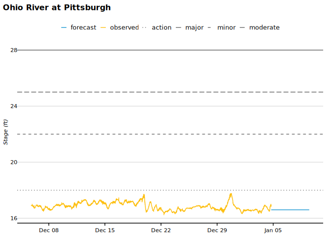

<!-- README.md is generated from README.Rmd. Please edit that file -->

# nwps

<!-- badges: start -->
<!-- badges: end -->

nwps provides R functions to access the [National Water Prediction
Service (NWPS) API](https://api.water.noaa.gov/nwps/v1/). The NWPS API
offers hydrological data including gauge metadata, stage and flow
observations and forecasts, flood categories, and National Water Model
streamflow predictions.

## Installation

You can install the development version of nwps from GitHub with:

``` r
# install.packages("pak")
pak::pak("UI-Research/nwps")
```

## Example

Retrieve observed and forecast stage data for a gauge, then visualize it
alongside flood thresholds:

``` r
library(nwps)
library(ggplot2)
library(urbnthemes)
library(dplyr)

set_urbn_defaults(style = "print")

# Get gauge metadata including flood categories
gauge <- nwps_gauge("PTTP1")

gauge_name <- gauge$metadata$name
flood_cats <- gauge$flood_categories

# Get observed and forecast stage/flow data
stageflow <- nwps_gauge_stageflow("PTTP1")

# Plot observed and forecast stages with flood thresholds
ggplot(stageflow, aes(x = valid_time, y = primary, color = product)) +
  geom_line() +
  geom_hline(
    data = flood_cats,
    aes(yintercept = stage, linetype = category),
    color = "gray40"
  ) +
  scale_linetype_manual(values = c("action" = "dotted", "minor" = "dashed",
                                   "moderate" = "longdash", "major" = "solid")) +
  labs(
    title = gauge_name,
    x = NULL,
    y = paste0("Stage (", stageflow$primary_units[1], ")"),
    color = "Product",
    linetype = "Flood Category"
  )
```



## Learn more

See `vignette("nwps")` for more examples and detailed usage of all
package functions.
