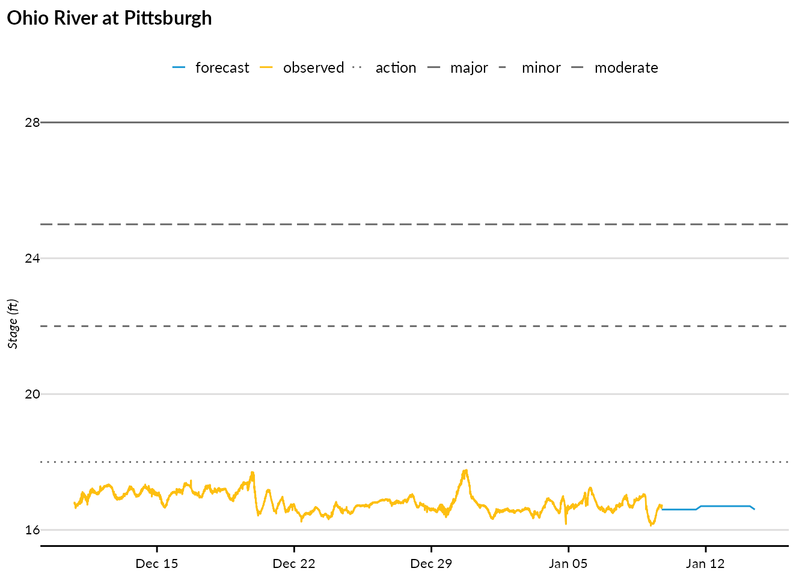
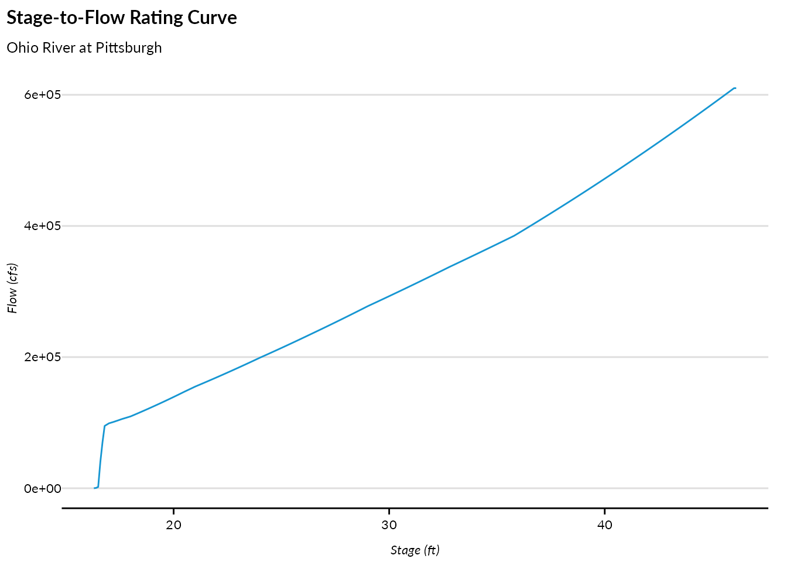
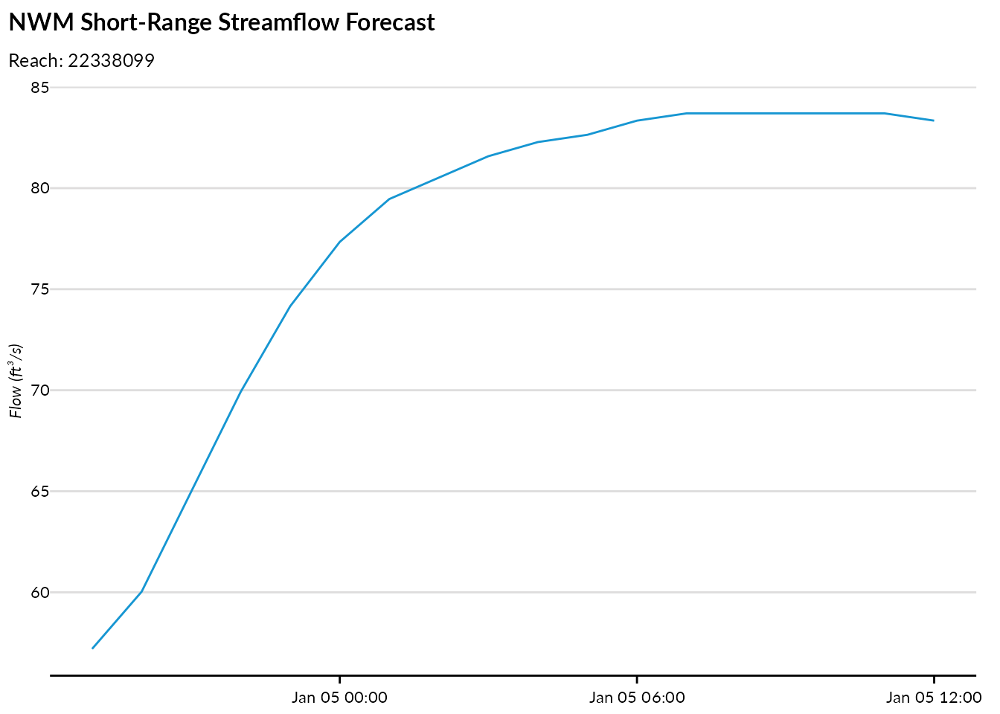

# Getting started with nwps

``` r
library(nwps)
library(ggplot2)
library(urbnthemes)
library(dplyr)

set_urbn_defaults(style = "print")
#> Warning: The `size` argument of `element_line()` is deprecated as of ggplot2 3.4.0.
#> ℹ Please use the `linewidth` argument instead.
#> ℹ The deprecated feature was likely used in the urbnthemes package.
#>   Please report the issue at
#>   <https://github.com/UrbanInstitute/urbnthemes/issues>.
#> This warning is displayed once per session.
#> Call `lifecycle::last_lifecycle_warnings()` to see where this warning was
#> generated.
#> Warning: The `size` argument of `element_rect()` is deprecated as of ggplot2 3.4.0.
#> ℹ Please use the `linewidth` argument instead.
#> ℹ The deprecated feature was likely used in the urbnthemes package.
#>   Please report the issue at
#>   <https://github.com/UrbanInstitute/urbnthemes/issues>.
#> This warning is displayed once per session.
#> Call `lifecycle::last_lifecycle_warnings()` to see where this warning was
#> generated.
```

## Introduction

The nwps package provides R functions to access the [National Water
Prediction Service (NWPS) API](https://api.water.noaa.gov/nwps/v1/). The
NWPS API offers hydrological data including:

- Gauge metadata and current status
- Stage and flow observations and forecasts
- Flood categories and impact statements
- Stage-to-flow rating curves
- National Water Model (NWM) streamflow forecasts

This vignette demonstrates how to use each of the package’s core
functions.

## Finding gauges

### List all gauges in an area

Use
[`nwps_gauges()`](https://ui-research.github.io/nwps/reference/nwps_gauges.md)
to retrieve gauges within a bounding box. The function returns an sf
object with point geometries.

``` r
# Get gauges in the Washington DC area
dc_gauges <- nwps_gauges(
  bbox = c(-77.5, 38.5, -76.5, 39.5),
  srid = "EPSG_4326"
)

dc_gauges |>
  select(lid, name, state_abbreviation, status_observed_flood_category)
#> Simple feature collection with 189 features and 4 fields
#> Geometry type: POINT
#> Dimension:     XY
#> Bounding box:  xmin: -77.4763 ymin: 38.54577 xmax: -76.53142 ymax: 39.48944
#> Geodetic CRS:  WGS 84
#> # A tibble: 189 × 5
#>    lid   name                          state_abbreviation status_observed_floo…¹
#>    <chr> <chr>                         <chr>              <chr>                 
#>  1 ABPV2 Backlick Run at Armistead Bo… VA                 no_flooding           
#>  2 ACRV2 Cameron Run at Alexandria     VA                 out_of_service        
#>  3 AFRV2 Four Mile Run at Alexandria   VA                 no_flooding           
#>  4 ALEV2 Four Mile Run above Highway … VA                 no_flooding           
#>  5 ANAD2 Anacostia River at Washingto… DC                 out_of_service        
#>  6 ANAV2 Accotink Creek near Annandale VA                 no_flooding           
#>  7 APSV2 Unnamed Tributary at New Ale… VA                 no_flooding           
#>  8 ATGV2 Unnamed Tributary above New … VA                 no_flooding           
#>  9 AXTV2 Potomac River at Alexandria   VA                 no_flooding           
#> 10 BBSV2 Buckhall Branch at Signal Hi… VA                 not_defined           
#> # ℹ 179 more rows
#> # ℹ abbreviated name: ¹​status_observed_flood_category
#> # ℹ 1 more variable: geometry <POINT [°]>
```

You can also filter to gauges with CatFIM (Categorical Flood Inundation
Mapping) configuration:

``` r
catfim_gauges <- nwps_gauges(
  bbox = c(-77.5, 38.5, -76.5, 39.5),
  catfim = TRUE
)
#> No gauges found matching the specified criteria.

nrow(catfim_gauges)
#> [1] 0
```

## Getting gauge details

### Retrieve gauge metadata

Use
[`nwps_gauge()`](https://ui-research.github.io/nwps/reference/nwps_gauge.md)
to get detailed metadata for a specific gauge by its LID or USGS ID. The
function returns a list with multiple components.

``` r
gauge <- nwps_gauge("PTTP1")

# Basic metadata (as sf object)
gauge$metadata
#> Simple feature collection with 1 feature and 12 fields
#> Geometry type: POINT
#> Dimension:     XY
#> Bounding box:  xmin: -80.01083 ymin: 40.43944 xmax: -80.01083 ymax: 40.43944
#> Geodetic CRS:  WGS 84
#> # A tibble: 1 × 13
#>   lid   usgs_id  reach_id name   description latitude longitude time_zone county
#> * <chr> <chr>    <chr>    <chr>  <chr>          <dbl>     <dbl> <chr>     <chr> 
#> 1 PTTP1 03085152 3786893  Ohio … ""              40.4     -80.0 EST5EDT   Alleg…
#> # ℹ 4 more variables: in_service <lgl>, in_service_message <chr>,
#> #   forecast_reliability <chr>, geometry <POINT [°]>

# Organizational affiliations
gauge$organizations
#> # A tibble: 1 × 6
#>   rfc_abbreviation rfc_name         wfo_abbreviation wfo_name state_abbreviation
#>   <chr>            <chr>            <chr>            <chr>    <chr>             
#> 1 OHRFC            Ohio River Fore… PBZ              Moon To… PA                
#> # ℹ 1 more variable: state_name <chr>

# Flood category thresholds
gauge$flood_categories
#> # A tibble: 4 × 5
#>   category stage stage_units  flow flow_units
#>   <chr>    <int> <chr>       <int> <chr>     
#> 1 action      18 ft          -9999 cfs       
#> 2 minor       22 ft          -9999 cfs       
#> 3 moderate    25 ft          -9999 cfs       
#> 4 major       28 ft          -9999 cfs
```

### View flood impact statements

Many gauges have stage-based impact statements describing what happens
at different water levels:

``` r
gauge$flood_impacts
#> # A tibble: 24 × 2
#>    stage statement                                                              
#>    <dbl> <chr>                                                                  
#>  1  46   Severe damage occurs in Pittsburgh with up to 15 feet of water in the …
#>  2  40   PNC Park is flooded along Federal Street.                              
#>  3  38   Water reaches the floor of Brunots Island Power Station.               
#>  4  37   Water reaches the floor level of Rivers Casino.                        
#>  5  36.6 Steam distribution lines in Pittsburgh are in jeopardy. Water reaches …
#>  6  36   Serious flood damage occurs to about 500 businesses on the North Side …
#>  7  35.8 Flood waters reach the historic levels of Hurricane Agnes on June 26, …
#>  8  35   The river level reaches a critical stage for Acrisure Stadium and PNC …
#>  9  32   Mckees Rocks is affected. Flooding occurs on Neville Island.           
#> 10  31   Water reaches the railroad tracks at Station Square on the South Side.…
#> # ℹ 14 more rows
```

### Historical flood crests

You can also access historical and recent flood crest records:

``` r
gauge$flood_crests |>
  arrange(desc(stage)) |>
  head(5)
#> # A tibble: 5 × 6
#>   type     occurred_time       stage  flow preliminary old_datum
#>   <chr>    <dttm>              <dbl> <int> <chr>       <lgl>    
#> 1 historic 1936-03-18 00:00:00  46       0 R           FALSE    
#> 2 recent   1936-03-18 00:00:00  46       0 R           FALSE    
#> 3 historic 1907-03-15 00:00:00  38.5     0 O           FALSE    
#> 4 recent   1907-03-15 00:00:00  38.5     0 O           FALSE    
#> 5 historic 1942-12-31 00:00:00  36.6     0 O           FALSE
```

## Stage and flow time series

### Get observed and forecast data

Use
[`nwps_gauge_stageflow()`](https://ui-research.github.io/nwps/reference/nwps_gauge_stageflow.md)
to retrieve stage and flow time series. By default, it returns both
observed and forecast data.

``` r
stageflow <- nwps_gauge_stageflow("PTTP1")

stageflow |>
  group_by(product) |>
  summarize(
    n_obs = n(),
    min_time = min(valid_time),
    max_time = max(valid_time),
    .groups = "drop"
  )
#> # A tibble: 2 × 4
#>   product  n_obs min_time            max_time           
#>   <chr>    <int> <dttm>              <dttm>             
#> 1 forecast    20 2026-01-09 18:00:00 2026-01-14 12:00:00
#> 2 observed  8603 2025-12-10 18:55:00 2026-01-09 18:15:00
```

### Visualize the hydrograph

Plot the observed and forecast stages alongside flood thresholds:

``` r
flood_cats <- gauge$flood_categories

ggplot(stageflow, aes(x = valid_time, y = primary, color = product)) +
  geom_line() +
  geom_hline(
    data = flood_cats,
    aes(yintercept = stage, linetype = category),
    color = "gray40"
  ) +
  scale_linetype_manual(
    values = c("action" = "dotted", "minor" = "dashed",
               "moderate" = "longdash", "major" = "solid")
  ) +
  labs(
    title = gauge$metadata$name,
    x = NULL,
    y = paste0("Stage (", stageflow$primary_units[1], ")"),
    color = "Product",
    linetype = "Flood Category"
  )
#> Warning: The `scale_name` argument of `discrete_scale()` is deprecated as of ggplot2
#> 3.5.0.
#> This warning is displayed once per session.
#> Call `lifecycle::last_lifecycle_warnings()` to see where this warning was
#> generated.
```



### Get only observed or forecast data

You can request just one product type:

``` r
observed_only <- nwps_gauge_stageflow("PTTP1", product = "observed")
forecast_only <- nwps_gauge_stageflow("PTTP1", product = "forecast")

nrow(observed_only)
#> [1] 8604
nrow(forecast_only)
#> [1] 20
```

## Stage-to-flow ratings

### Get the rating curve

Use
[`nwps_gauge_ratings()`](https://ui-research.github.io/nwps/reference/nwps_gauge_ratings.md)
to retrieve the stage-to-flow rating curve for a gauge:

``` r
ratings <- nwps_gauge_ratings("PTTP1")

head(ratings)
#> # A tibble: 6 × 4
#>   stage stage_units  flow flow_units
#>   <dbl> <chr>       <int> <chr>     
#> 1  16.3 ft              0 cfs       
#> 2  16.4 ft            500 cfs       
#> 3  16.5 ft           2000 cfs       
#> 4  16.6 ft          40009 cfs       
#> 5  16.7 ft          70016 cfs       
#> 6  16.8 ft          95021 cfs
```

### Visualize the rating curve

``` r
ggplot(ratings, aes(x = stage, y = flow)) +
  geom_line() +
  labs(
    title = "Stage-to-Flow Rating Curve",
    subtitle = gauge$metadata$name,
    x = paste0("Stage (", ratings$stage_units[1], ")"),
    y = paste0("Flow (", ratings$flow_units[1], ")")
  )
```



## National Water Model data

The NWPS API also provides access to National Water Model (NWM)
streamflow forecasts by reach.

### Get reach metadata

Use
[`nwps_reach()`](https://ui-research.github.io/nwps/reference/nwps_reach.md)
to retrieve metadata for an NWM reach:

``` r
reach <- nwps_reach("22338099")

reach$metadata
#> Simple feature collection with 1 feature and 4 fields
#> Geometry type: POINT
#> Dimension:     XY
#> Bounding box:  xmin: -76.9508 ymin: 38.9149 xmax: -76.9508 ymax: 38.9149
#> Geodetic CRS:  WGS 84
#> # A tibble: 1 × 5
#>   reach_id name            latitude longitude           geometry
#> * <chr>    <chr>              <dbl>     <dbl>        <POINT [°]>
#> 1 22338099 Beaverdam Creek     38.9     -77.0 (-76.9508 38.9149)
reach$streamflow_products
#> [1] "analysis_assimilation" "short_range"           "long_range"           
#> [4] "medium_range_blend"    "medium_range"
```

The `upstream` and `downstream` tibbles show the reach network routing:

``` r
head(reach$upstream)
#> # A tibble: 2 × 2
#>   reach_id stream_order
#>   <chr>    <chr>       
#> 1 22338093 4           
#> 2 22338095 4
head(reach$downstream)
#> # A tibble: 1 × 2
#>   reach_id stream_order
#>   <chr>    <chr>       
#> 1 22338123 4
```

### Get NWM streamflow forecasts

Use
[`nwps_reach_streamflow()`](https://ui-research.github.io/nwps/reference/nwps_reach_streamflow.md)
to retrieve streamflow forecasts. Different forecast series are
available:

- `"analysis_assimilation"`: Analysis and assimilation (recent past)
- `"short_range"`: Short-range forecast (0-18 hours)
- `"medium_range"`: Medium-range ensemble forecast (0-10 days)
- `"medium_range_blend"`: Blended medium-range forecast
- `"long_range"`: Long-range ensemble forecast (0-30 days)

``` r
short_range <- nwps_reach_streamflow("22338099", series = "short_range")

short_range |>
  head(10)
#> # A tibble: 10 × 7
#>    reach_id series    member reference_time      valid_time           flow units
#>    <chr>    <chr>     <chr>  <dttm>              <dttm>              <dbl> <chr>
#>  1 22338099 short_ra… series 2026-01-09 16:00:00 2026-01-09 17:00:00  56.1 ft³/s
#>  2 22338099 short_ra… series 2026-01-09 16:00:00 2026-01-09 18:00:00  56.5 ft³/s
#>  3 22338099 short_ra… series 2026-01-09 16:00:00 2026-01-09 19:00:00  56.9 ft³/s
#>  4 22338099 short_ra… series 2026-01-09 16:00:00 2026-01-09 20:00:00  57.6 ft³/s
#>  5 22338099 short_ra… series 2026-01-09 16:00:00 2026-01-09 21:00:00  58.6 ft³/s
#>  6 22338099 short_ra… series 2026-01-09 16:00:00 2026-01-09 22:00:00  59.7 ft³/s
#>  7 22338099 short_ra… series 2026-01-09 16:00:00 2026-01-09 23:00:00  61.8 ft³/s
#>  8 22338099 short_ra… series 2026-01-09 16:00:00 2026-01-10 00:00:00  65.7 ft³/s
#>  9 22338099 short_ra… series 2026-01-09 16:00:00 2026-01-10 01:00:00  69.9 ft³/s
#> 10 22338099 short_ra… series 2026-01-09 16:00:00 2026-01-10 02:00:00  73.4 ft³/s
```

### Visualize NWM forecasts

``` r
ggplot(short_range, aes(x = valid_time, y = flow)) +
  geom_line() +
  labs(
    title = "NWM Short-Range Streamflow Forecast",
    subtitle = paste("Reach:", reach$metadata$reach_id),
    x = NULL,
    y = paste0("Flow (", short_range$units[1], ")")
  )
```



### Ensemble forecasts

For medium and long-range forecasts, multiple ensemble members are
available:

``` r
medium_range <- nwps_reach_streamflow("22338099", series = "medium_range")

medium_range |>
  group_by(member) |>
  summarize(n = n(), .groups = "drop")
#> # A tibble: 6 × 2
#>   member      n
#>   <chr>   <int>
#> 1 mean      204
#> 2 member1   240
#> 3 member3   204
#> 4 member4   204
#> 5 member5   204
#> 6 member6   204
```

## SHEF product codes

### Access data by PEDTS code

For more granular control, use
[`nwps_product_stageflow()`](https://ui-research.github.io/nwps/reference/nwps_product_stageflow.md)
to request data by specific SHEF PEDTS (Physical Element Data Type
Source) code:

``` r
# Get the PEDTS codes for a gauge
gauge$pedts
#> # A tibble: 1 × 2
#>   observed forecast
#>   <chr>    <chr>   
#> 1 HGIR2    HGIFF

# Request observed data using PEDTS code
observed_pedts <- nwps_product_stageflow("PTTP1", "HGIRG")

head(observed_pedts)
#> # A tibble: 6 × 12
#>   pedts issued_time         wfo   time_zone valid_time         
#>   <chr> <dttm>              <chr> <chr>     <dttm>             
#> 1 HGIRG 2026-01-09 18:30:00 PBZ   EST5EDT   2025-12-10 18:50:00
#> 2 HGIRG 2026-01-09 18:30:00 PBZ   EST5EDT   2025-12-10 18:55:00
#> 3 HGIRG 2026-01-09 18:30:00 PBZ   EST5EDT   2025-12-10 19:00:00
#> 4 HGIRG 2026-01-09 18:30:00 PBZ   EST5EDT   2025-12-10 19:05:00
#> 5 HGIRG 2026-01-09 18:30:00 PBZ   EST5EDT   2025-12-10 19:10:00
#> 6 HGIRG 2026-01-09 18:30:00 PBZ   EST5EDT   2025-12-10 19:15:00
#> # ℹ 7 more variables: generated_time <dttm>, primary <dbl>, primary_name <chr>,
#> #   primary_units <chr>, secondary <dbl>, secondary_name <chr>,
#> #   secondary_units <chr>
```

## System monitoring

### Check API status

Use
[`nwps_monitor()`](https://ui-research.github.io/nwps/reference/nwps_monitor.md)
to check the system health and data status:

``` r
status <- nwps_monitor()

# Gauges by observed flood category
status$gauge_observed
#> # A tibble: 9 × 3
#>   type     category        count
#>   <chr>    <chr>           <int>
#> 1 observed action             26
#> 2 observed low_threshold      86
#> 3 observed major               3
#> 4 observed minor               1
#> 5 observed moderate            1
#> 6 observed no_flooding      6790
#> 7 observed not_defined      3967
#> 8 observed obs_not_current   878
#> 9 observed out_of_service    804

# Gauges by forecast flood category
status$gauge_forecast
#> # A tibble: 8 × 3
#>   type     category         count
#>   <chr>    <chr>            <int>
#> 1 forecast action              42
#> 2 forecast fcst_not_current  9540
#> 3 forecast low_threshold        5
#> 4 forecast minor                1
#> 5 forecast moderate             1
#> 6 forecast no_flooding       1783
#> 7 forecast not_defined        380
#> 8 forecast out_of_service     804
```

The monitoring endpoint also provides information about data processing:

``` r
# HML product processing stats
status$hml_product_counts
#> # A tibble: 102 × 2
#>    time_period count
#>    <chr>       <int>
#>  1 t-10day     47087
#>  2 t-10hour     1950
#>  3 t-11day     46954
#>  4 t-11hour     1955
#>  5 t-12day     47038
#>  6 t-12hour     1951
#>  7 t-13day     47107
#>  8 t-13hour     1953
#>  9 t-14day     47099
#> 10 t-14hour     1955
#> # ℹ 92 more rows

# Long Range Outlook status
status$lro
#> # A tibble: 1 × 2
#>   current_lros current_interval
#>          <int> <chr>           
#> 1         1029 JFM
```

## Summary

The nwps package provides a complete interface to the National Water
Prediction Service API:

| Function                                                                                             | Description                          |
|------------------------------------------------------------------------------------------------------|--------------------------------------|
| [`nwps_gauges()`](https://ui-research.github.io/nwps/reference/nwps_gauges.md)                       | List gauges with spatial filtering   |
| [`nwps_gauge()`](https://ui-research.github.io/nwps/reference/nwps_gauge.md)                         | Get detailed gauge metadata          |
| [`nwps_gauge_ratings()`](https://ui-research.github.io/nwps/reference/nwps_gauge_ratings.md)         | Get stage-to-flow rating curves      |
| [`nwps_gauge_stageflow()`](https://ui-research.github.io/nwps/reference/nwps_gauge_stageflow.md)     | Get observed/forecast stage and flow |
| [`nwps_reach()`](https://ui-research.github.io/nwps/reference/nwps_reach.md)                         | Get NWM reach metadata               |
| [`nwps_reach_streamflow()`](https://ui-research.github.io/nwps/reference/nwps_reach_streamflow.md)   | Get NWM streamflow forecasts         |
| [`nwps_product_stageflow()`](https://ui-research.github.io/nwps/reference/nwps_product_stageflow.md) | Get data by SHEF PEDTS code          |
| [`nwps_monitor()`](https://ui-research.github.io/nwps/reference/nwps_monitor.md)                     | Check system status                  |

For more information about the NWPS API, visit the [API
documentation](https://api.water.noaa.gov/nwps/v1/).
